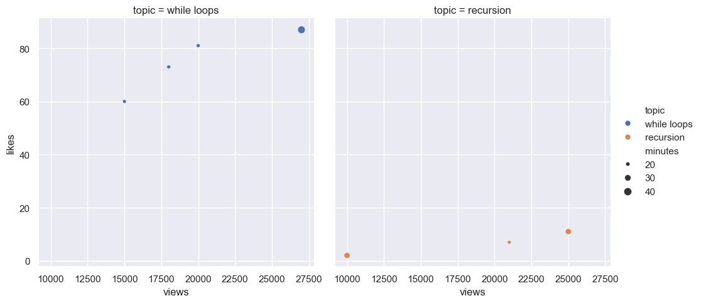
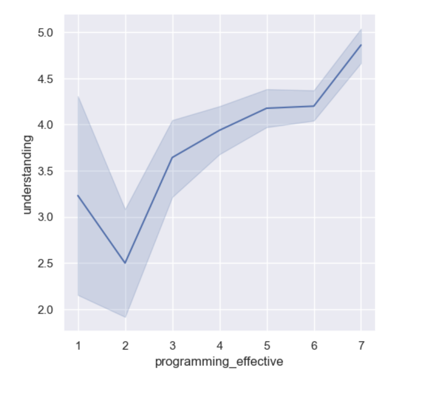
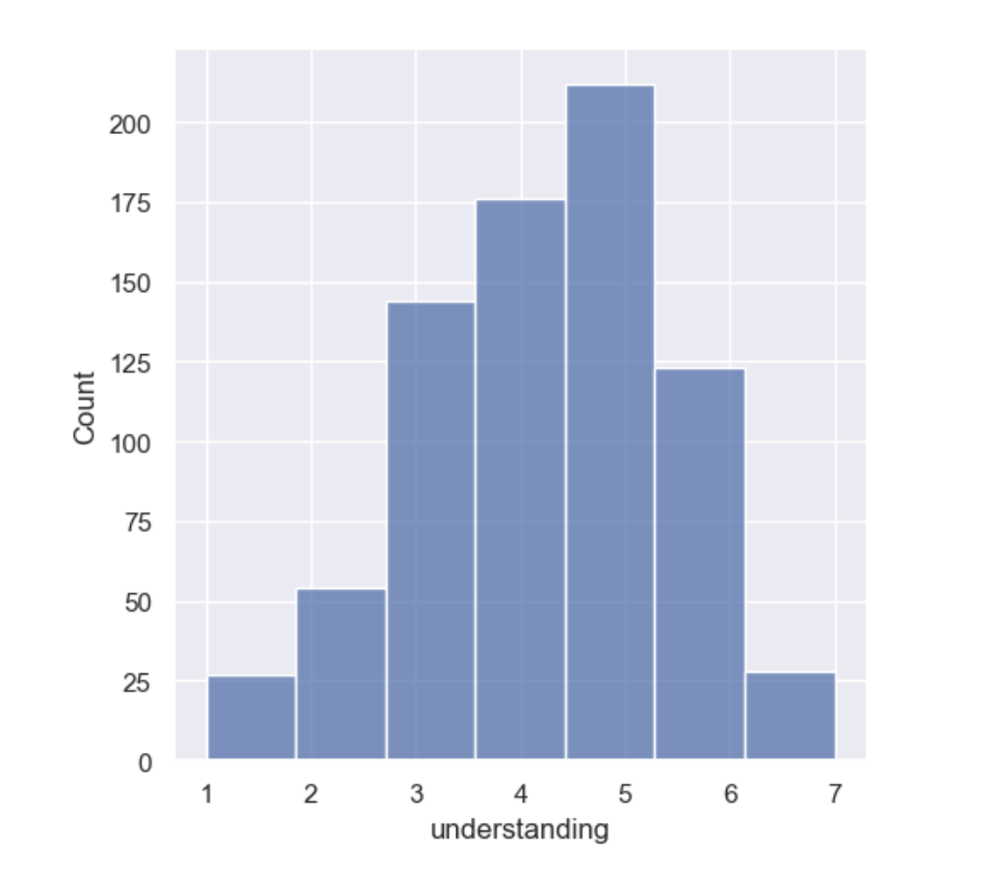

# My COMP110 Survey Analysis: LSQS and Understanding

## 1. Project Summary
In this analysis, I explored the relationship between student engagement with learning tools (LSQS) and their self-reported programming effectiveness and understanding. Using the Seaborn library in Python, I visualized the survey data to uncover patterns in how students learn complex programming concepts.

---

## 2. Data Visualizations

### Student-Specific LSQS Effectiveness (Scatter Plot)
This scatter plot (chart1) displays the individual effectiveness scores of LSQS reported by each student in the dataset. It helps identify the spread and variety of student experiences with this learning tool.

**Conclusion:** The scatter plot shows that while many students find LSQS highly effective, there is a significant spread across the scores. This variation suggests that different students have diverse learning experiences with the tool, highlighting the importance of personalized learning support.

### Programming Effectiveness vs. Concept Understanding (Line Chart)
This line chart (chart2) illustrates the trend between how effective students found their programming practice and their resulting level of understanding. 

**Conclusion:** There is a clear upward trend—as students find programming practice more effective, their reported understanding level also tends to increase.

### Distribution of Understanding Levels (Histogram)
This distribution plot (chart3), created with 7 bins, shows how many students fall into each understanding category from 1 to 7.

**Conclusion:** By analyzing the frequency of these scores, we can determine the "mode" or most common level of understanding in the class, providing insight into the overall academic health of the group.

---

## 3. Final Conclusion
The data shows that most students believe practice exercises are effective, and that the effectiveness of practice is positively correlated with the level of understanding. This suggests that the idea of “increasing the number of practice exercises” is reasonable. It is particularly worth noting that a small proportion of students still have a low level of understanding (scoring 1–2 points); increasing the number of practice exercises can help them consolidate their knowledge. My recommendation is to introduce optional, ungraded practice exercises accompanied by answer explanations. This way, students who wish to practice can do so, while those who do not will not feel pressured. Of course, this may increase the workload for both teachers and students and add stress for some students. Since my analysis relies primarily on indirect data, a future survey could include a direct question: “Would more ungraded practice exercises help me learn?” (rated 1–7), to gain a more accurate understanding of students’ actual needs.