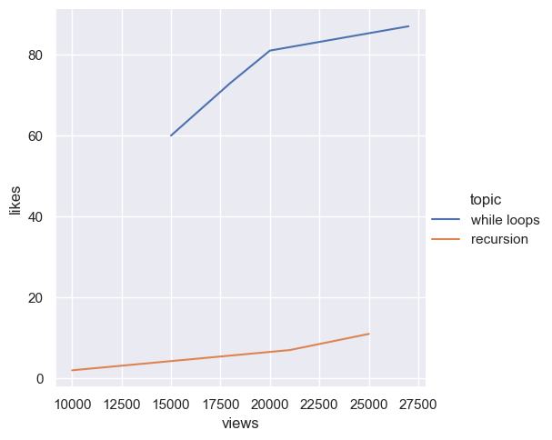
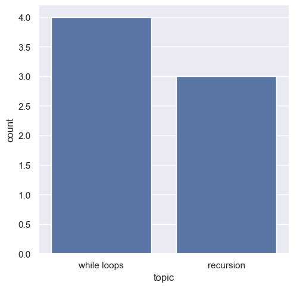

# UNC COMP110 Survey Analysis: Python Concepts

## 1. Project Summary
In this analysis, I explored a dataset containing student survey responses related to programming concepts. Specifically, I focused on the relationship between study habits, video views, and performance on topics like **while loops** and **recursion**. The goal was to see how engagement correlates with student understanding.

---

## 2. Data Visualizations

### Comparison of Views vs. Likes (Scatter Plot)
The first visualization shows how student engagement (views) relates to their feedback (likes) across different topics.

### Engagement Trends (Line Chart)
This trend line helps us visualize the growth of student satisfaction as their engagement increases. 

### Topic Frequency (Bar Chart)
This chart provides a simple count of how many students engaged with each specific Python topic.

---

## 3. Conclusion
Based on my analysis, student engagement is a strong indicator of concept mastery. Topics that are more complex, like recursion, might require more visual aids or time to reach the same threshold as simpler logic structures. Overall, the data suggests that consistent viewing leads to higher student satisfaction.